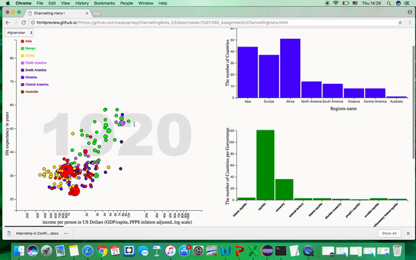

# ChannellingRolls_D3

 1. Go into folder named 15211282_Assignment2 and finde .html file called ChannellingHans
 2 copy the url https://github.com/cassiyemay/ChannellingRolls_D3/blob/master/15211282_Assignment2/ChannellingHans.html
 3 open website http://htmlpreview.github.com/.
 4 put the .html file into this website
 5 The outcome is like below(this web app is animation )

